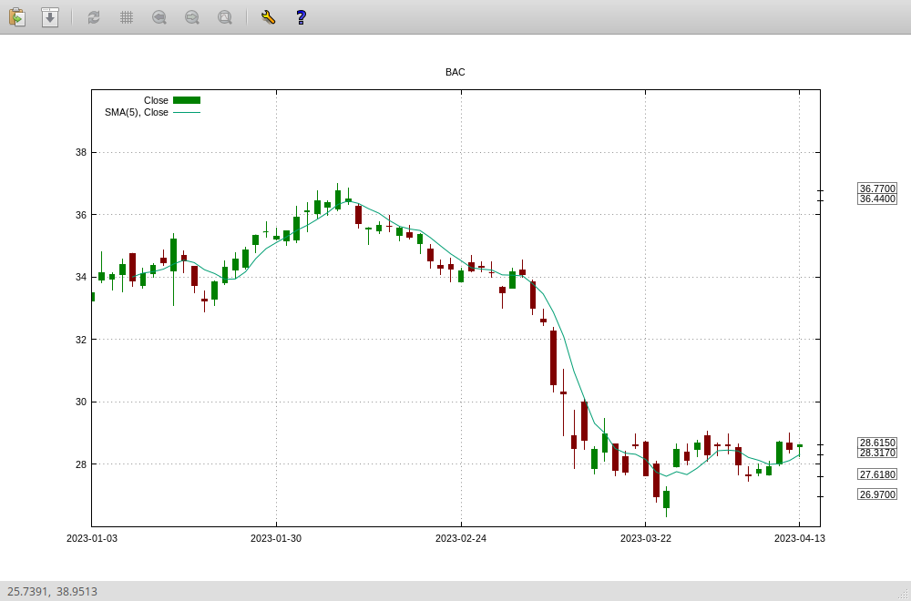

# fin
This project aims to provide a set of personal investment tools with minimum dependencies.

The project does not have a GUI. You interact with the tools by writing Python scripts. The most actively developed part of the project is the `fin.seq` package that provides time/data series manipulation functions.

# Getting started
I keep the dependencies to a minimum. Currently, outside Python 3 (≥ 3.6.9) and the standard Python library, you need:

* Python Requests (≥ 2.18.4)
* Cython3 (≥ 0.26.1)
* Gnuplot (≥ 5.2)

There was some development regarding web crawling and data mining using BeautifulSoup, but it is currently out of the main tree.

## Prerequisites
The development is done under Linux Ubuntu Bionic.

```
apt-get install python3 cython3 python3-requests gnuplot-x11
```

## Installation
Download the project using Git, enter the directory, and run `make compile` to compile and build the Cython-generated C files, and `make tests-all` to run the all test suite:

```
git clone git@github.com:s-leroux/fin.git
cd fin
make compile
make tests-all
```

# `fin.seq`
This package allows data manipulations using the concept of table and columns. You may think of it like a spreadsheet, but without the WISIWIG interface.

Here is a short example (from `examples/fin/seq/basic.py`):
```
from fin.seq import table
from fin.seq import algo
from fin.seq import expr

from math import pi, sin, cos

# Create an empty table with provision for 361 rows:
t = table.Table(361)

# Create a column with values from 0 to 360
t.add_column("ROW NUMBER", expr.ramp())

# Create a second column that maps the first to the [0, 2π] range
def deg2rad(deg):
    return 2*pi*deg/360

t.add_column("ANGLE", (expr.map(deg2rad), "ROW NUMBER"))

# Do the same to map than ANGLE column to sin() and cos()
t.add_column("SIN", (expr.map(sin), "ANGLE"))
t.add_column("COS", (expr.map(cos), "ANGLE"))

# Print the table
print(t)
```

Here is the result when you run this script:
```
sh$ python3 basic-example.py
 ROW NUMBER      ANGLE        SIN        COS
---------------------------------------------
          0     0.0000     0.0000     1.0000
          1     0.0175     0.8415     0.5403
          2     0.0349     0.9093    -0.4161
          3     0.0524     0.1411    -0.9900
          4     0.0698    -0.7568    -0.6536
          5     0.0873    -0.9589     0.2837
          6     0.1047    -0.2794     0.9602
          7     0.1222     0.6570     0.7539
    ...
```

You can load that table in your favorite spreadsheet to plot the SIN/COS graph. If you have `gnuplot` installed on your system, you can also plot it directly from Python:
```
# Plot the SIN/COS function:
from fin.seq import plot
mp = plot.Multiplot(t, "SIN", mode="XY")
p = mp.new_plot()
p.draw_line("COS")

plot.gnuplot(mp, size=(800,600))
```


## Joining two tables
Tables support join operation on *key* columns.
It is caller's responsability to ensure the key columns are *sorted in ascending order*.
Joining tables on unordered key columns is an *undefined behavior*.

### Inner join
When performing an inner-join, the result table will contain only rows present in both tables according to the key column.

```
from fin.seq import table as table

t1 = table.table_from_dict({"c":[1,2,3,4], "d":[1,1,1,1]})
t2 = table.table_from_dict({"c":[1,3], "e":[21,23]})
t3 = table.join(t1, t2, "c")
print(t3)

 c d e
-------
 1 1 21
 3 1 23
```

### Outer join
When performing an outer-join, the result table will contain rows present in either (or both tables) according to the key column.

If the keyword parameter `propagate` is set to `False` (the dafault), missing data will be set to `None` in the result table.
Otherwise, the last known values are used.

```
# Continuing from the previous example

t3 = table.outer_join(t1,t2,"c")
print(t3)

 c d    e
----------
 1 1   21
 2 1 None
 3 1   23
 4 1 None
```

```
# Continuing from the previous example

t3 = table.outer_join(t1,t2,"c", propagate=True)
print(t3)

 c d    e
----------
 1 1   21
 2 1   21
 3 1   23
 4 1   23
```

## Loading financial data
You can use the `fin.seq` package like a command-line spreadsheet. But its primary purpose remains working with financial data.

Currently, the library supports the *Yahoo! Finance* and *eodhistoricaldata.com* data providers for historical quotes. 

In the next example, we will load from *Yahoo! Finance* the last 100 end-of-day quote for *Bank of America* (ticker `BAC`):
```
from fin.api import yf
from fin.seq import algo
from fin.seq import plot

# Use the Yahoo! Finance provider
provider = yf.Client()

t = provider.historical_data("BAC", dict(days=100))
```
The provider returns a table (instance of `table.Table`) with the data, open, high, low, close, adj close and volumes columns. You can add more columns if you need. In the example, I will add a 5-period simple moving average:
```
sma = t.add_column((algo.sma(5), "Close"))
```

Finally, let's plot the graph:
```
mp = plot.Multiplot(t, "Date")
p = mp.new_plot(3)
p.draw_candlestick("Open", "High", "Low", "Close")
p.draw_line(sma.name)

plot.gnuplot(mp, size=(1000,600), font="Sans,8")
```
Et voilà:



# `fin.model`
The ``fin`` package also contains a simple 1-variable solver (implemented in ``fin.math``) designed to work seamlessly with predefined models.

For example, using the [Kelly Criterion](https://en.wikipedia.org/wiki/Kelly_criterion) you can find the optimum allocation for a risky investment:

```
WIN=0.20
LOSS=0.20
WIN_PROB=0.60

model = kelly.KellyCriterion(dict(
    p=WIN_PROB,
    a=WIN,
    b=LOSS,
    ))

f_star = model['f_star']
```

You can solve a model for any variable (bearing the solver's limitation).
For example, if I'm ready to raise my allocation up to 50% of the available funds, and given a +/- 20% outcome, which probability to win do I implicitly assume?

```
WIN=0.20
LOSS=0.20
ALLOC=0.50

model = kelly.KellyCriterion(dict(
    a=WIN,
    b=LOSS,
    f_star=ALLOC
    ))

print("Implied probability to win =", model['p'])
```
